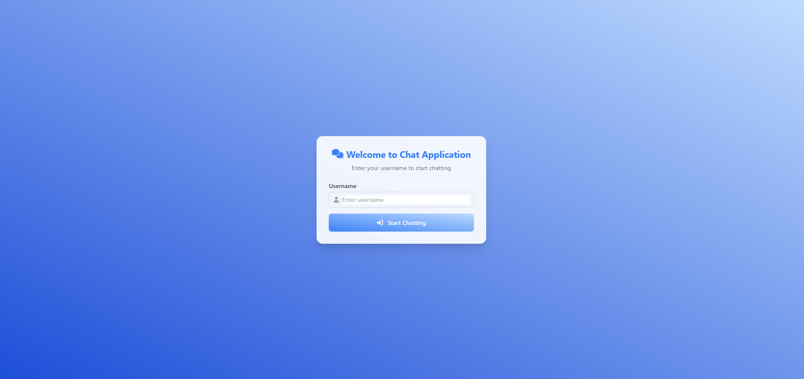

# Chat Application - Real-time Multi-Instance Messaging Platform

## 📋 Table of Contents
- [Overview](#overview)
- [Technology Stack](#technology-stack)
- [Architecture & Core Concepts](#architecture--core-concepts)
- [System Requirements](#system-requirements)
- [Installation & Setup](#installation--setup)
- [Execution Flow](#execution-flow)
- [API Endpoints](#api-endpoints)
- [Configuration](#configuration)
- [Troubleshooting](#troubleshooting)

## 🚀 Overview

A sophisticated real-time chat application built with Spring Boot that supports horizontal scaling through multiple instances. The application leverages WebSocket for real-time bidirectional communication and Redis (DragonflyDB) as a pub/sub message broker to enable seamless message distribution across multiple server instances.

### Key Features
- **Real-time messaging** with instant message delivery
- **Multi-instance support** for horizontal scaling
- **User join/leave notifications**
- **Persistent connections** using WebSocket with SockJS fallback
- **Modern responsive UI** with Tailwind CSS
- **JSON-based message serialization**
- **Connection status monitoring**

## 🛠 Technology Stack

### Backend
- **Java 21** - Primary programming language
- **Spring Boot 3.5.7** - Application framework
- **Spring WebSocket** - Real-time communication
- **Spring Data Redis** - Redis integration
- **STOMP** - WebSocket sub-protocol
- **Lombok** - Boilerplate code reduction
- **Validation API** - Input validation

### Frontend
- **HTML5** - Markup
- **Tailwind CSS** - Utility-first CSS framework
- **JavaScript ES6+** - Client-side logic
- **SockJS Client** - WebSocket fallback library
- **STOMP.js** - STOMP protocol implementation
- **jQuery** - DOM manipulation
- **Font Awesome** - Icons

### Infrastructure
- **DragonflyDB** - Redis-compatible in-memory database
- **Docker** - Containerization
- **Maven** - Dependency management and build tool

## 🏗 Architecture & Core Concepts

### System Architecture
```
Client Browser ↔ Spring Boot Instance ↔ Redis Pub/Sub ↔ Other Spring Boot Instances
     ↑                    ↑                              ↑
WebSocket/STOMP    Message Processing              Message Broadcasting
```

### Core Components

1. **WebSocket Configuration** (`WebsocketConfig`)
    - Enables STOMP over WebSocket
    - Configures message broker prefixes
    - Sets up SockJS fallback endpoint

2. **Redis Pub/Sub Integration** (`RedisConfig`)
    - Message listener container for Redis channels
    - JSON serialization for message objects
    - Channel topic configuration for chat messages

3. **Message Flow Controller** (`ChatController`)
    - Handles incoming WebSocket messages
    - Routes messages to appropriate services
    - Manages user session lifecycle

4. **Message Subscriber** (`RedisMessageSubscriber`)
    - Listens to Redis pub/sub channels
    - Converts Redis messages to WebSocket messages
    - Broadcasts messages to connected clients

5. **Session Management** (`WebsocketEventListener`)
    - Detects WebSocket disconnections
    - Handles user leave notifications
    - Maintains session integrity

## 📋 System Requirements

- **Java**: JDK 21 or later
- **Docker**: 20.10+ (for DragonflyDB)
- **Memory**: Minimum 2GB RAM
- **Browser**: Modern browser with WebSocket support

## ⚙️ Installation & Setup

### Step 1: Clone and Prepare the Project
```bash
# Ensure you have the project files in the appropriate directory structure
chatapplication/
├── src/
├── pom.xml
├── docker-compose.yaml
└── application*.properties
```

### Step 2: Start DragonflyDB (Redis-compatible)
```bash
# Navigate to project root and start the database
docker-compose up -d
```

Verify DragonflyDB is running:
```bash
docker ps
# Should show dragonfly container running on port 6379
```

### Step 3: Build the Application
```bash
# Clean and package the application
mvn clean package
```

### Step 4: Run Application Instances

**Terminal 1 - Instance 1 (Port 8081):**
```bash
mvn spring-boot:run -Dspring-boot.run.profiles=instance1
```

**Terminal 2 - Instance 2 (Port 8082):**
```bash
mvn spring-boot:run -Dspring-boot.run.profiles=instance2
```

### Step 5: Access the Application
Open your browser and navigate to:
- **Default Port**: http://localhost:8080
- **Instance 1**: http://localhost:8081
- **Instance 2**: http://localhost:8082

## 🔄 Execution Flow

### 1. User Connection Sequence
```
1. User enters username → Submits form
2. Client establishes WebSocket connection via SockJS
3. STOMP connection initiated to `/chat-application` endpoint
4. Client subscribes to `/topic/public` for incoming messages
5. System sends JOIN notification via `/app/chat.adduser`
6. User joins chat room successfully
```

### 2. Message Broadcasting Flow
```
1. User sends message → Client publishes to `/app/chat.send`
2. ChatController receives message via @MessageMapping
3. ChatService processes and timestamps the message
4. RedisMessageService publishes to Redis "chat" channel
5. All RedisMessageSubscriber instances receive the message
6. Each subscriber converts and broadcasts via SimpMessageSendingOperations
7. All connected clients receive the message via WebSocket
```

### 3. Multi-Instance Synchronization
```
Instance 1 (User A)         Redis Pub/Sub          Instance 2 (User B)
     ↓                            ↓                        ↓
Send Message →→→→→→→→→→→ "chat" channel →→→→→→→→→ Receive Message
     ↑                            ↑                        ↑
WebSocket Client           DragonflyDB             WebSocket Client
```

## 🌐 API Endpoints

### WebSocket Endpoints
| Endpoint | Type | Purpose |
|----------|------|---------|
| `/chat-application` | STOMP | WebSocket connection endpoint |
| `/app/chat.send` | MessageMapping | Send chat messages |
| `/app/chat.adduser` | MessageMapping | Add user to chat |
| `/topic/public` | Subscription | Receive broadcast messages |

### Message Types
```java
public enum MessageType {
    CHAT,    // Regular chat message
    JOIN,    // User joined notification
    LEAVE    // User left notification
}
```

## ⚙️ Configuration

### Application Properties

**`application.properties` (Base Configuration):**
```properties
spring.application.name=chatapplication
```

**`application-instance1.properties`:**
```properties
server.port=8081
```

**`application-instance2.properties`:**
```properties
server.port=8082
```

### Redis Configuration
The application automatically connects to Redis on `localhost:6379` through the Docker configuration in `docker-compose.yaml`.

## 🐛 Troubleshooting

### Common Issues and Solutions

1. **Port Already in Use**
   ```bash
   # Check if ports 8081/8082 are occupied
   netstat -an | grep 8081
   # Kill process if necessary or use different ports
   ```

2. **DragonflyDB Connection Issues**
   ```bash
   # Verify DragonflyDB is running
   docker logs dragonfly
   # Test Redis connection
   redis-cli ping
   ```

3. **WebSocket Connection Failures**
    - Check browser console for errors
    - Verify SockJS and STOMP libraries are loaded
    - Ensure no firewall blocking WebSocket connections

4. **Multi-Instance Communication Issues**
    - Verify both instances show "Connected" status
    - Check Redis pub/sub messages are being delivered
    - Monitor application logs for exceptions

### Logging and Monitoring

The application includes comprehensive logging:
- Connection events (user join/leave)
- Message processing steps
- Redis pub/sub operations
- Error handling with stack traces

Check application logs for real-time debugging:
```bash
# Tail logs for a specific instance
tail -f /path/to/application.log
```

## 🎯 Usage Instructions

1. **Starting the System**: Follow the installation steps above
2. **User Registration**: Enter any username to join the chat
3. **Sending Messages**: Type in the message input and press Enter or click send
4. **Multi-Instance Testing**: Open multiple browser tabs/windows on different ports to test cross-instance messaging
5. **Monitoring**: Observe connection status and user count in the UI

## 📈 Scaling Considerations

This architecture supports:
- **Horizontal scaling** by adding more Spring Boot instances
- **Load balancing** through external load balancer
- **High availability** with multiple instances
- **Session independence** - any instance can handle any user

The Redis pub/sub pattern ensures all instances receive all messages, maintaining consistency across the entire system.


